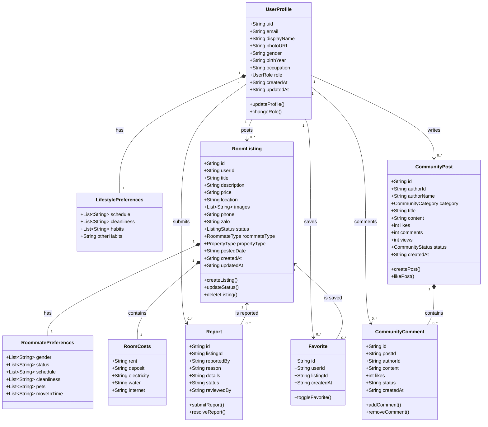

# Sơ Đồ Lớp (Class Diagram) - roomieVerse

Mô hình dữ liệu (Database Schema / Class Diagram) của hệ thống roomieVerse được thiết kế gọn gàng thông qua các entities cốt lõi trong file `types.ts`.
Dưới đây là sơ đồ Class Diagram bằng Mermaid, bạn có thể copy vào [Mermaid Live](https://mermaid.live/) để xuất ảnh chèn báo cáo.

### Giải thích các mối quan hệ (Relationships):
1. **Thành phần (Composition `*--`)**: 
   - `UserProfile` chứa `LifestylePreferences`.
   - `RoomListing` chứa `RoommatePreferences` và `RoomCosts`.
   - `CommunityPost` chứa danh sách các `CommunityComment`.
2. **Liên kết (Association `-->`)**:
   - `User (UserProfile)` tạo ra nhiều Bài đăng phòng (`RoomListing`), Bài cộng đồng (`CommunityPost`).
   - `User` có thể tạo nhiều `Favorite` (Lưu bài) và `Report` (Báo cáo vi phạm).
