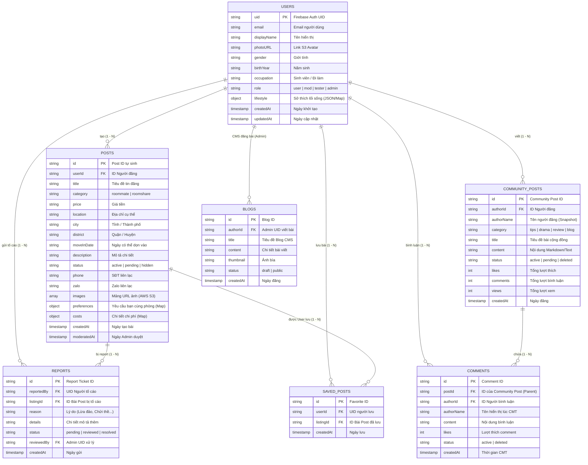

# Sơ Đồ Cơ Sở Dữ Liệu (Database Diagram / ERD) - roomieVerse

Do roomieVerse sử dụng Cloud Firestore (NoSQL), sơ đồ dữ liệu dưới đây sẽ được mô phỏng theo dạng Collections/Documents (Tương đương Tables/Rows trong SQL) với quan hệ Liên kết ID (Bởi NoSQL không có Foreign Key cứng).

Sơ đồ sử dụng chuẩn **ER Diagram** (Entity Relationship) của Mermaid. Bạn hãy copy mã dưới đây vào **[Mermaid Live Editor](https://mermaid.live/)** để dán vào file báo cáo.

### Phân tích Kiến trúc NoSQL Firestore của RoomieVerse:
1. **Denormalization (Phi chuẩn hóa dữ liệu)**:
   - Trong bảng `COMMUNITY_POSTS` và `COMMENTS`, thay vì chỉ lưu `authorId`, hệ thống RoomieVerse đã lưu trữ thêm cả `authorName` và `authorPhoto`. Việc copy dữ liệu này (Snapshotting) là kỹ thuật kinh điển trong NoSQL giúp giảm thiểu số lần gọi Query Read để "Join" bảng `USERS`, tối ưu hóa tối đa tốc độ hiển thị và chi phí đọc Data của Firebase.
2. **Sub-Collections / Root Collections**:
   - `COMMENTS` có thể được tổ chức dưới dạng Sub-collection của `COMMUNITY_POSTS` (`community_posts/{id}/comments/{id}`) để giới hạn scope query.
   - Các dữ liệu phức tạp (`lifestyle`, `preferences`, `costs`) được lưu trữ dưới dạng **Map (JSON Object)** trong chính Document cha để tránh phải tách bảng như SQL.
3. **Array Data**:
   - `images` chứa trực tiếp một mảng (Array) các Link liên kết qua dịch vụ Amazon S3 thay vì phải tạo một bảng `IMAGES` riêng rẽ như SQL.
