# Sơ Đồ Luồng Dữ Liệu Ngữ Cảnh DFD Level 0 (Context Diagram)

DFD Level 0 (Hay còn gọi là sơ đồ Context) là sơ đồ cung cấp bức tranh tổng thể nhất về cách hệ thống tương tác với các thực thể bên ngoài (External Entities).

Mã Mermaid dưới đây mô tả DFD Level 0 của hệ thống **roomieVerse**. Bạn có thể dùng [Mermaid Live Editor](https://mermaid.live/) để xuất ảnh báo cáo.

```mermaid
%%{init: {"theme": "default", "themeVariables": { "primaryColor": "#ffffff", "edgeLabelBackground":"#ffffff"}}}%%
flowchart TD
    %% Định dạng style cho Thực thể ngoài (Hình chữ nhật vuông)
    classDef external fill:#bbdefb,stroke:#1976d2,stroke-width:2px,rx:0,ry:0;
    
    %% Định dạng style cho Process hệ thống chính (Hình tròn hoặc Elip)
    classDef process fill:#c8e6c9,stroke:#388e3c,stroke-width:2px,rx:20,ry:20;
    
    %% Định dạng Database (nếu cần thiết ở mức 0, dù thường đặt ở Level 1)
    classDef db fill:#ffe0b2,stroke:#f57c00,stroke-width:2px;

    %% Thực Thể Ngoài (External Entities)
    Guest["Khách (Guest)"]:::external
    User["Người dùng (Khách thuê/Chủ phòng)"]:::external
    Admin["Quản trị viên (Admin/Mod)"]:::external
    ThirdParty["Dịch vụ Đám mây (S3/Google)"]:::external

    %% Process Chính (Hệ thống)
    System(("HỆ THỐNG\nTÌM PHÒNG/ROOMMATE\nroomieVerse")):::process

    %% Luồng dữ liệu (Data Flows)

    %% Khách <-> Hệ thống
    Guest -- "Truy vấn tìm kiếm, Lọc phòng" --> System
    System -- "Kết quả danh sách phòng (Text/Ảnh)" --> Guest
    Guest -- "Yêu cầu Đăng ký / Đăng nhập" --> System
    System -- "Token Xác thực (JWT)" --> Guest

    %% Người Dùng <-> Hệ thống
    User -- "Thông tin bài đăng (Giá, Vị trí...)" --> System
    User -- "Ảnh phòng, Hồ sơ cá nhân" --> System
    User -- "Thảo luận Cộng đồng, Like, Comment" --> System
    User -- "Báo cáo vi phạm (Report)" --> System
    
    System -- "Thông báo trạng thái bài đăng (Duyệt/Từ chối)" --> User
    System -- "Danh sách Feed Cộng đồng, Bài đã lưu" --> User
    System -- "Thông tin Liên lạc Chủ phòng" --> User

    %% Ban Quản Trị <-> Hệ thống
    Admin -- "Quyết định Duyệt/Xóa Bài/Tài khoản" --> System
    Admin -- "Bài viết Blog mới" --> System
    Admin -- "Lệnh thăng cấp User (Set Role)" --> System

    System -- "Danh sách Ticket Report chờ xử lý" --> Admin
    System -- "Danh sách Bài đăng đang Chờ duyệt (Pending)" --> Admin
    System -- "Báo cáo Thống kê lượng User" --> Admin

    %% Dịch vụ ngoài <-> Hệ thống
    System -- "Yêu cầu URL Sinh ảnh (AWS S3) / API Google" --> ThirdParty
    ThirdParty -- "Link Ảnh S3 Presigned / Info Auth Oauth2" --> System

```

### Giải thích Sơ Đồ Context (DFD Level 0):
1. **Các thực thể tham gia (External Entities)**: 
   - `Khách`: Cung cấp Data truy vấn, nhận lại view danh sách bài đăng.
   - `Người dùng`: Nguồn cấp dữ liệu lớn nhất (Bài viết, hình ảnh, profile, tương tác). Nhận lại Data tương tác từ người dùng khác (Bình luận, Contact).
   - `Admin`: Cung cấp lệnh điều khiển (Duyệt, Cấm, Set Quyền). Nhận từ hệ thống các bảng báo cáo và danh sách chờ xử lý.
   - `Hệ thống thứ 3 (AWS/GoogleAuth)`: Nhận file thô/Request và gởi trả Token/URL Link.
2. **Tiến trình chính (Process 0)**: Toàn bộ lõi của web **roomieVerse** gộp lại thành một bóng khí tròn duy nhất nằm ở trung tâm để phân luồng dữ liệu thô (Data Flows).
