# Danh Sách Sequence Diagram - roomieVerse (Mermaid)

Dưới đây là mã Mermaid cho 29 Sequence Diagrams (Biểu đồ Tuần tự) tương ứng với 29 chức năng trong bản thiết kế. Bạn có thể copy từng đoạn mã và dán vào [Mermaid Live Editor](https://mermaid.live/) hoặc chèn trực tiếp vào file Word/Markdown.

---

### 1. Phân Hệ Xác Thực (Authentication)

#### 1. AUTH-101: Đăng ký / Đăng nhập Email
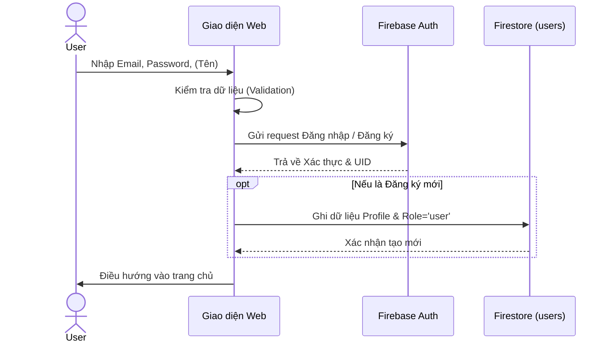

#### 2. AUTH-102: Đăng nhập Google
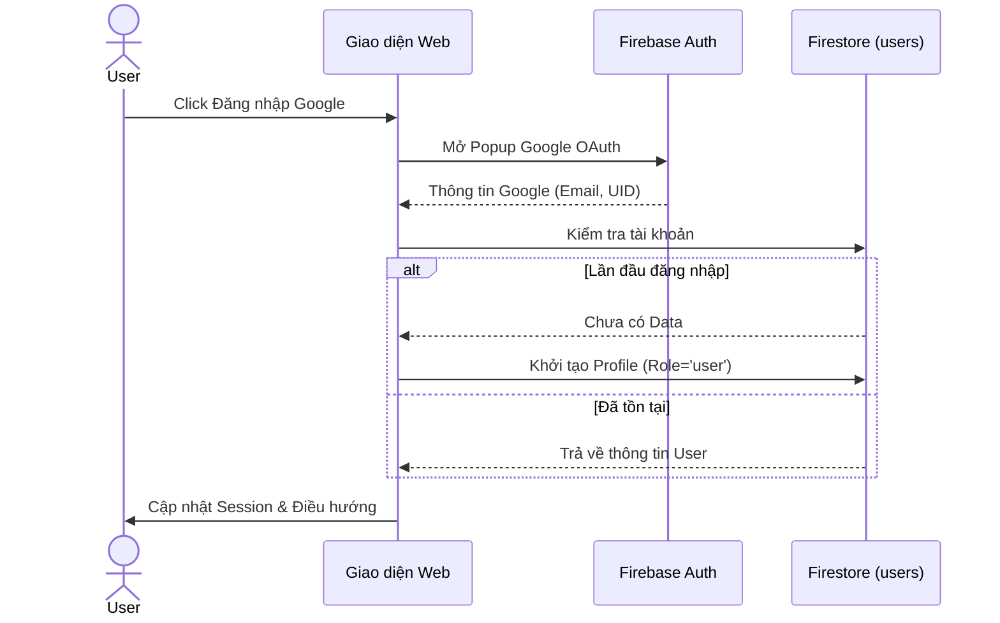

#### 3. AUTH-103: Quên Mật Khẩu
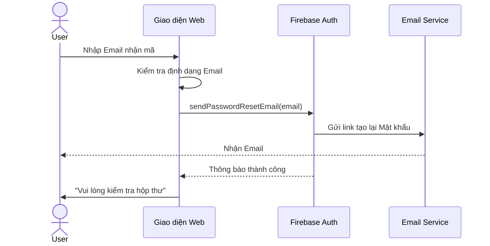

#### 4. AUTH-104: Đăng Xuất
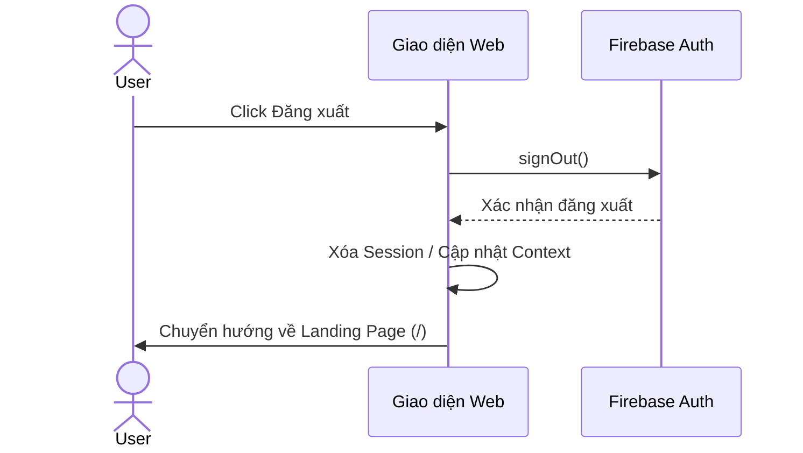

---

### 2. Phân Hệ Hồ Sơ (Profile)

#### 5. PROF-201: Cập nhật Thông tin
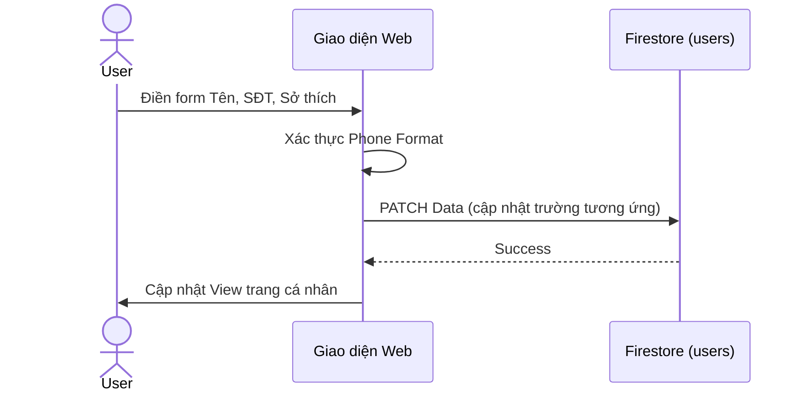

#### 6. PROF-202: Cập nhật Avatar
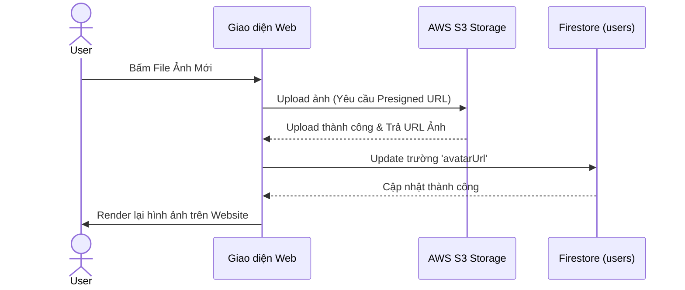

---

### 3. Phân Hệ Đăng Tin & Tìm Phòng (Posts)

#### 7. POST-301: Xem Danh sách
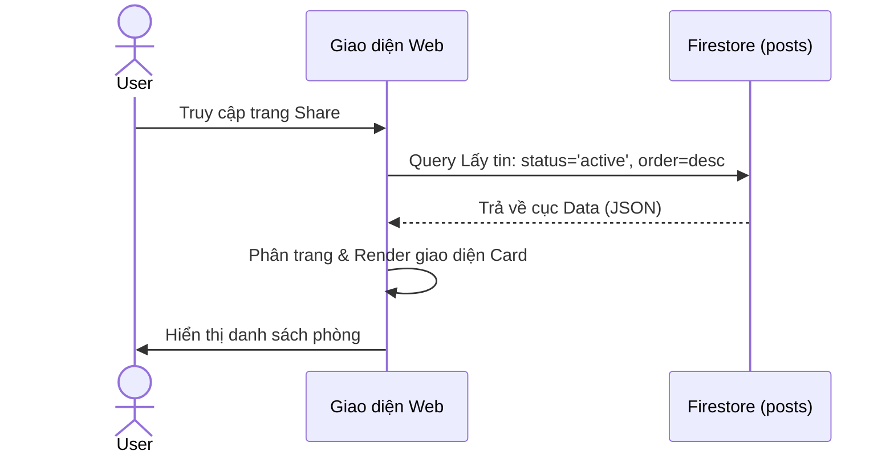

#### 8. POST-302: Lọc & Tìm kiếm
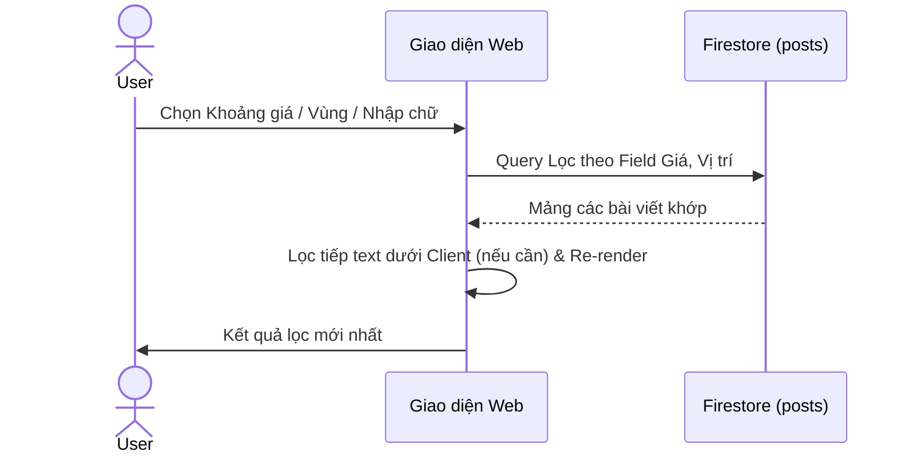

#### 9. POST-303: Xem Bài Chi Tiết
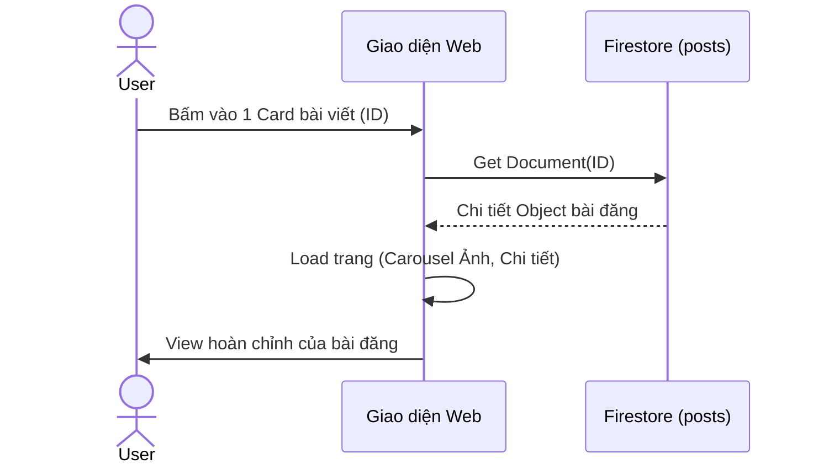

#### 10. POST-304: Đăng tin Phòng / Share
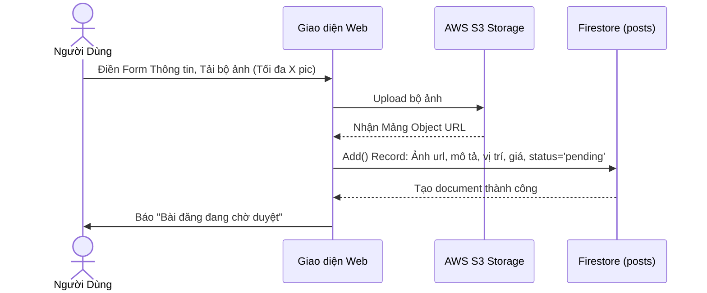

#### 11. POST-305: Đăng tin tìm Roommate
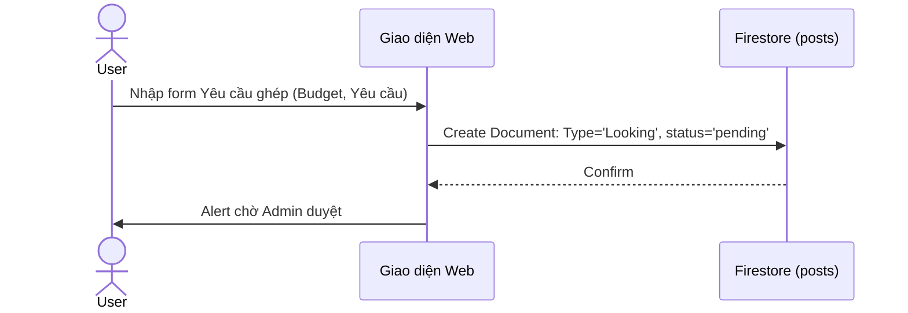

#### 12. POST-306: Ẩn/Hiện Tin (Toggle Status)
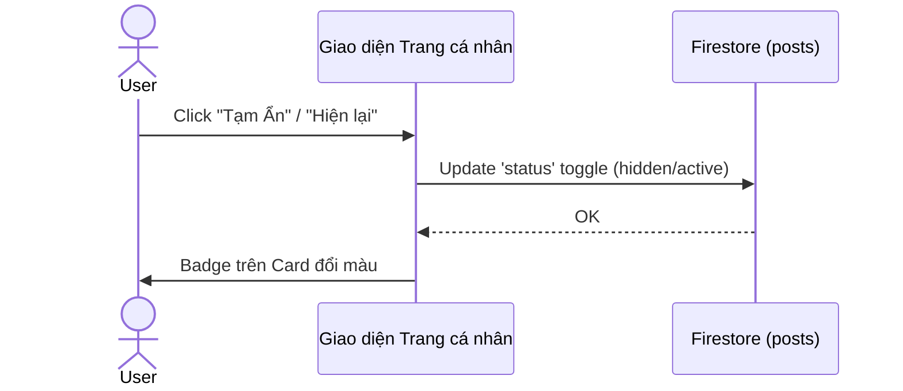

#### 13. POST-307: Xóa Tin Của Mình
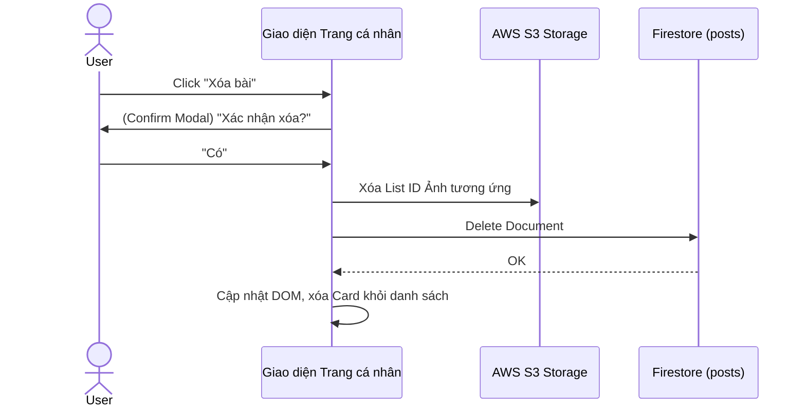

#### 14. POST-308: Lưu Tim (Favorite)
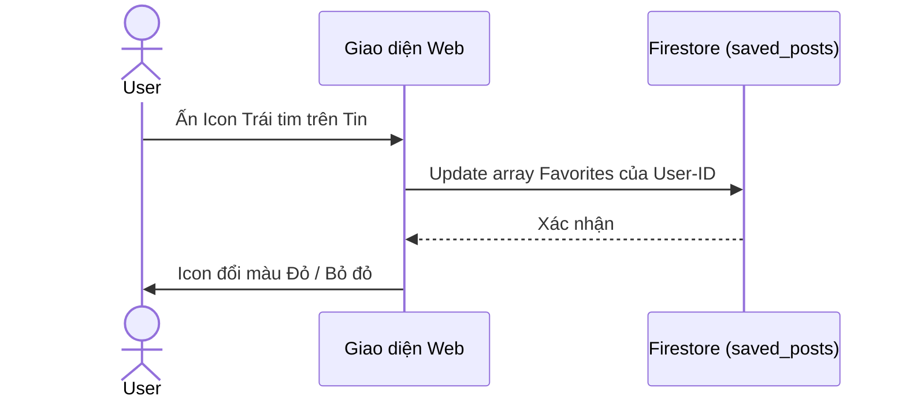

---

### 4. Phân Hệ Cộng Đồng (Community)

#### 15. COMM-401: Xem Tab Cộng Đồng
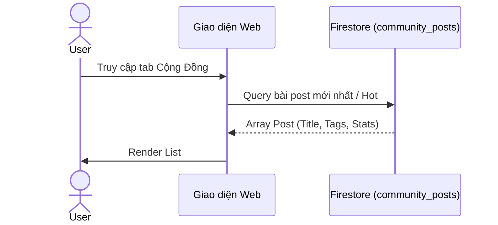

#### 16. COMM-402: Tạo Topic Mới
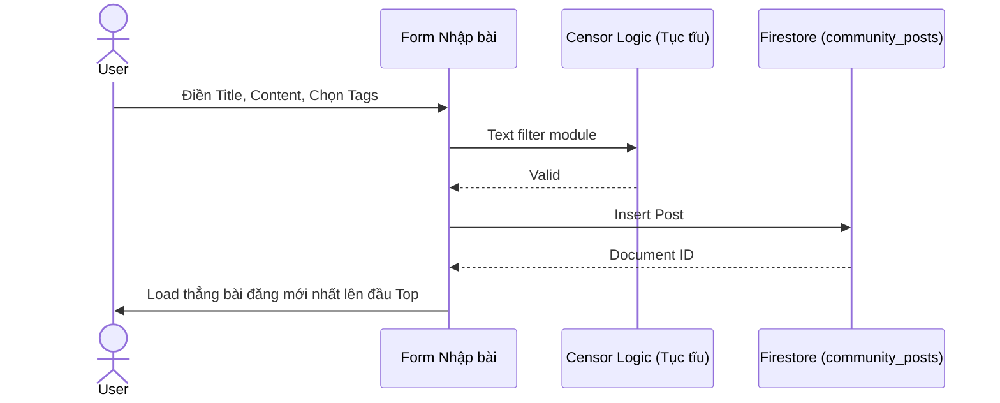

#### 17. COMM-403: Quản lý Bình luận
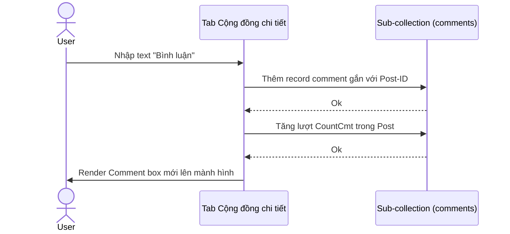

#### 18. COMM-404: Bấm Like Thảo luận
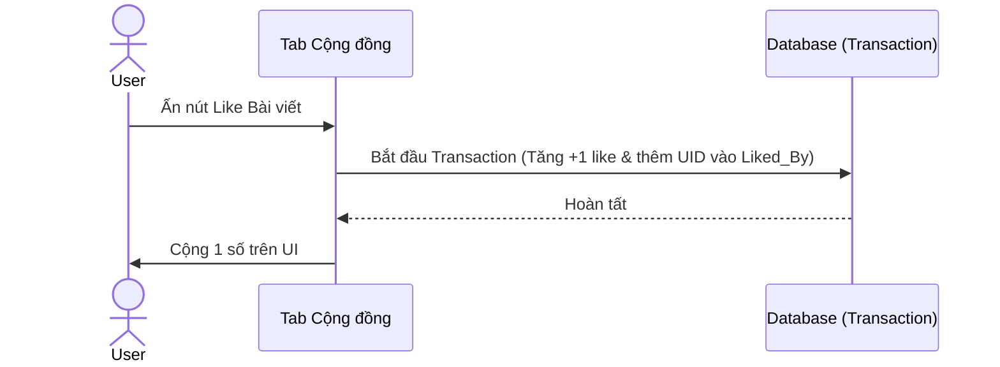

---

### 5. Phân Hệ Hệ Thống & Báo Cáo

#### 19. REP-501: Gửi Tố Cáo (Report)
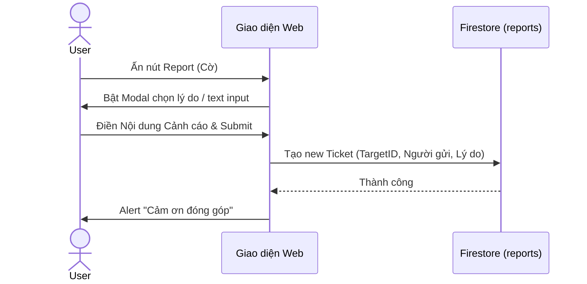

#### 20. SYS-601: Xem Trang Tĩnh Nhập Môn (Landing)
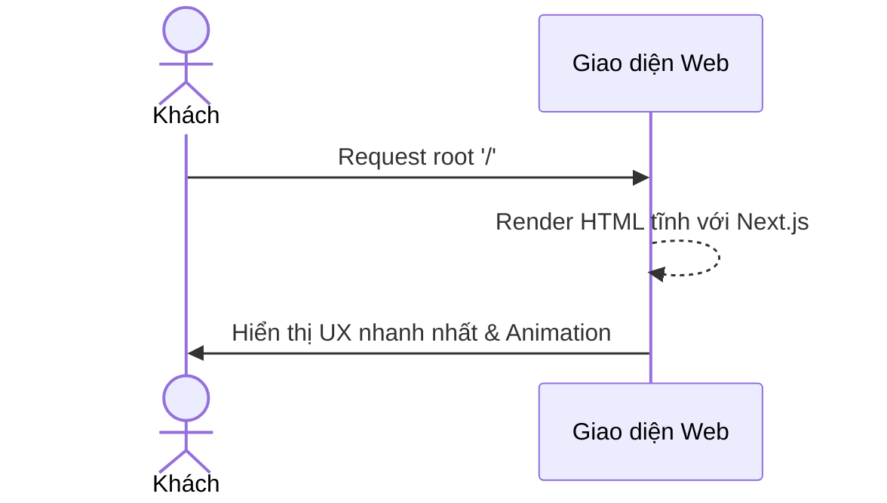

#### 21. SYS-602: Xem Điều khoản
```mermaid
sequenceDiagram
    actor G as Khách
    participant UI as Giao diện (About)

    G->>UI: Bấm vào 'Điều khoản sử dụng'
    UI->>UI: Load Component Markdown/Text
    UI->>G: Hiển thị luật lệ
```

---

### 6. Phân Hệ Quản Trị (Admin Dashboard)

#### 22. ADM-701: Admin Truy cập App
```mermaid
sequenceDiagram
    actor A as Mod / Admin
    participant UI as React UI (Router)
    participant Auth as AuthContext

    A->>UI: Trỏ Link `/admin`
    UI->>Auth: Kiểm tra UseAuth Hook (IsMod / IsAdmin?)
    Auth-->>UI: Trả về Cấp bậc
    UI->>A: Load Thành công Trang Dashboard
```

#### 23. ADM-702: Xem List Chờ duyệt (Duyệt Tin)
```mermaid
sequenceDiagram
    actor A as Mod / Admin
    participant UI as Admin Moderation
    participant DB as Firestore (posts)

    A->>UI: Vào mục Quản lý Tin mới
    UI->>DB: Query `status == 'pending'`
    DB-->>UI: Mảng Document chưa duyệt
    UI->>A: Hiện Grid Card dạng chờ duyệt
```

#### 24. ADM-703: Quyết Định (Duyệt/Thải) Bài
```mermaid
sequenceDiagram
    actor A as Mod / Admin
    participant UI as Admin Dashboard
    participant DB as Firestore (posts)

    A->>UI: Xem bài -> Bấm nút [Duyệt] hoặc [Từ chối]
    UI->>DB: PATCH status ('active' / 'rejected') 
    DB-->>UI: Xong
    UI->>A: Xóa Card khỏi Vùng Pending Queue
```

#### 25. ADM-704: Quản Trị Tab Cộng Đồng
```mermaid
sequenceDiagram
    actor A as Mod / Admin
    participant UI as Admin Community
    participant DB as Firestore (community_posts)

    A->>UI: Vào Mảng kiểm tra Viết Bậy
    UI->>DB: Query list Comment/Post nguy cơ Spam
    A->>UI: Click Xóa / Block Post
    UI->>DB: Thực thi Delete Action
    DB-->>UI: Confirm
    UI->>A: Cập nhật List
```

#### 26. ADM-705: Xử Lý Cờ Báo Cáo
```mermaid
sequenceDiagram
    actor A as Admin
    participant UI as Admin Report Tab
    participant DB as Firestore (reports)

    A->>UI: Xem Ticket Report #998
    UI->>A: Hiển thị nội dung
    A->>UI: Hành động Cảnh cáo / Xóa -> Click 'Resolve'
    UI->>DB: PATCH ticket status='resolved'
    DB-->>UI: Ticket khép lại
```

#### 27. ADM-706: Ban / Cấm Tài Khoản
```mermaid
sequenceDiagram
    actor A as Admin
    participant UI as Cài Đặt Users
    participant DB as Firestore (users)

    A->>UI: Check User Profile Lừa Đảo
    A->>UI: Nhấn 'Ban Account'
    UI->>DB: Cập nhật trạng thái Active=false
    DB-->>UI: OK
    UI->>A: Tài khoản đó khi Login sẽ bị Server văng ra
```

#### 28. ADM-707: Manage Roles (Cấp Quyền)
```mermaid
sequenceDiagram
    actor A as Super Admin
    participant UI as Quản lý Hệ Thống
    participant API as Next.js API Routes (Admin SDK)

    A->>UI: Chỉnh Role Của Minh Anh -> 'mod'
    UI->>API: Request POST Change Role
    API->>API: Xác minh Quyền Server AdminSDK
    API->>Firestore: Ghi đè Role trực tiếp
    Firestore-->>API: Success
    API-->>UI: Trả 200 OK Response
    UI->>A: UI hiện Cấp Quyền Thành Công
```

#### 29. ADM-708: Viết Blog SEO
```mermaid
sequenceDiagram
    actor A as Admin
    participant UI as Admin Blog CMS
    participant S3 as AWS S3 Storage
    participant DB as Firestore (blogs)

    A->>UI: Trình soạn thảo Text/Markdown Tip Ở Ghép
    UI->>S3: Tái sử dụng Module Upload S3 (Ảnh)
    A->>UI: Publish
    UI->>DB: Insert Collection 'blogs' (Status='public')
    DB-->>UI: Render ra Phía Front-end Web Blog
```
