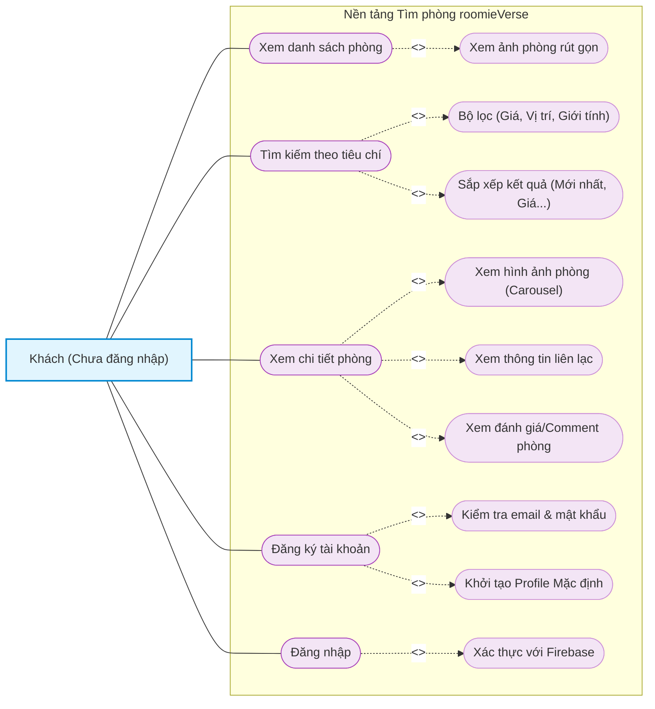
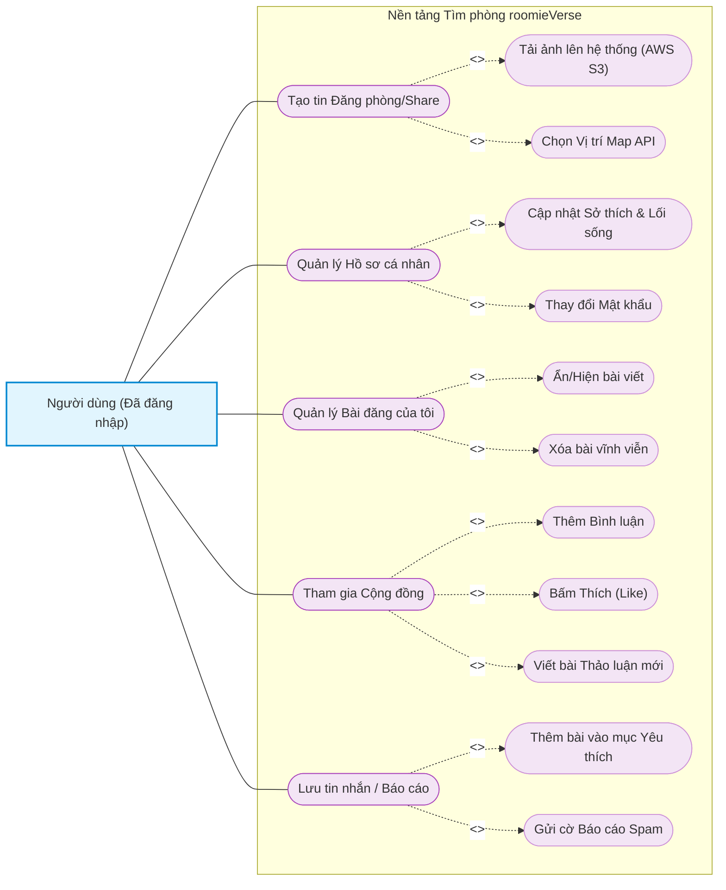
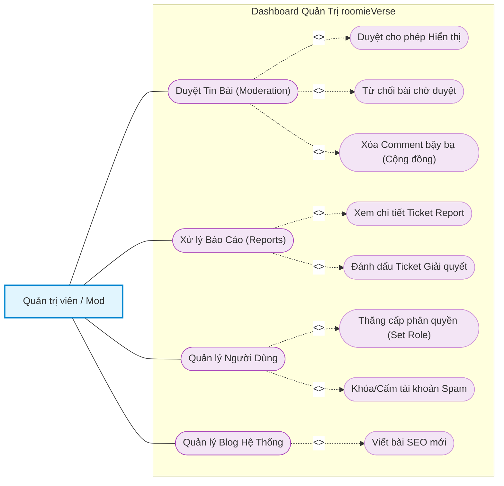

# 2.5.4. Sơ đồ Use Case phân rã (Elaborated Use Cases)

Dưới đây là các sơ đồ Use Case phân rã chi tiết cho từng nhóm Tác nhân trong hệ thống **roomieVerse**, thể hiện rõ các mối quan hệ `<<include>>` (bắt buộc) và `<<extend>>` (mở rộng).

---

### 1. Phân rã Use Case dành cho Khách (Guest)

Sơ đồ này biểu diễn các phân rã chức năng khi người dùng ở trạng thái chưa đăng nhập (Guest). Tương ứng hình: *Sơ đồ usecase dành cho Khách (chưa đăng nhập)*

---

### 2. Phân rã Use Case dành cho Người dùng (User)

Sơ đồ thể hiện các tác vụ phức tạp của User sau khi đăng nhập (Đăng tin, Quản lý hồ sơ, Tương tác cộng đồng).

---

### 3. Phân rã Use Case dành cho Ban Quản Trị (Admin Dashboard)

Sơ đồ thể hiện luồng làm việc của kiểm duyệt viên và admin.

